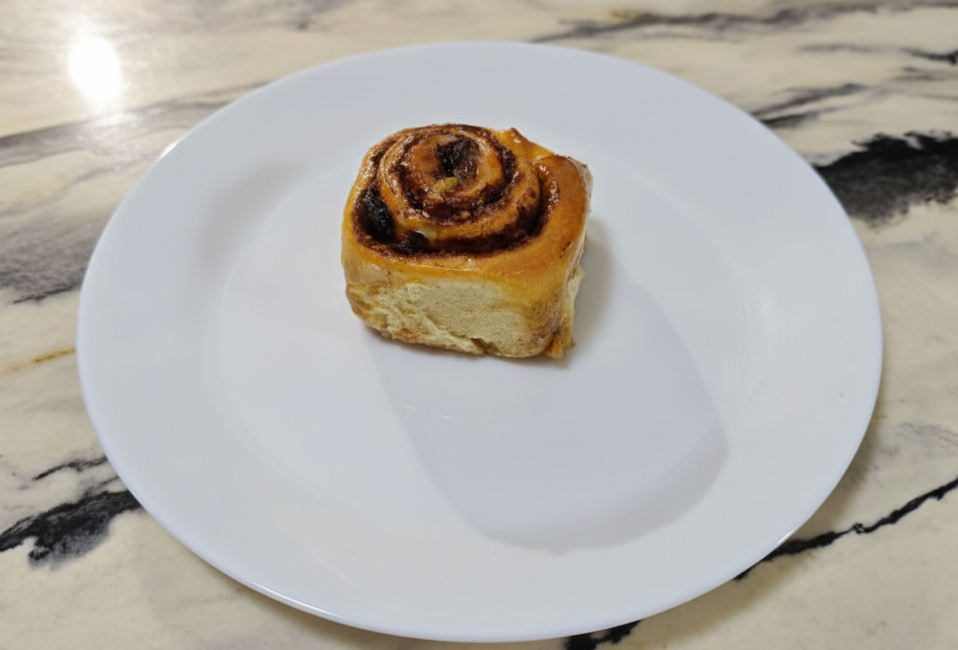
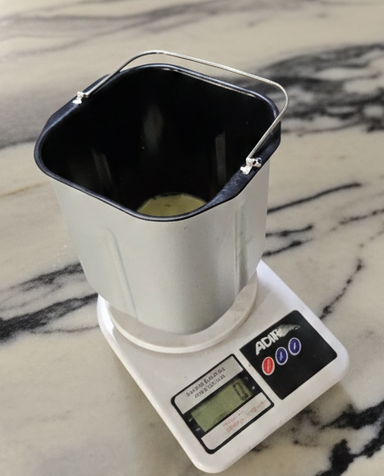
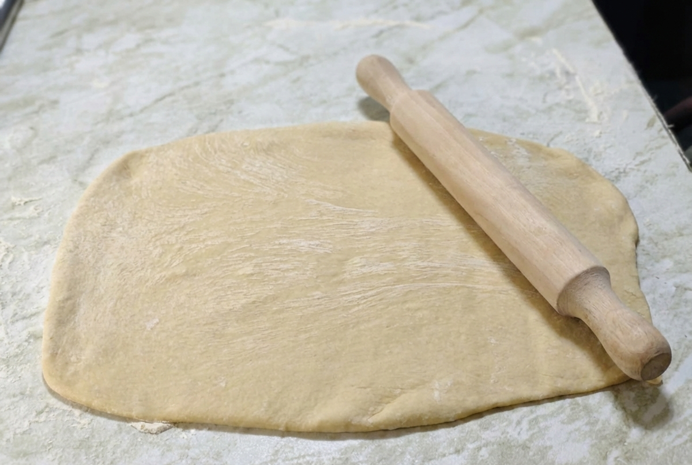
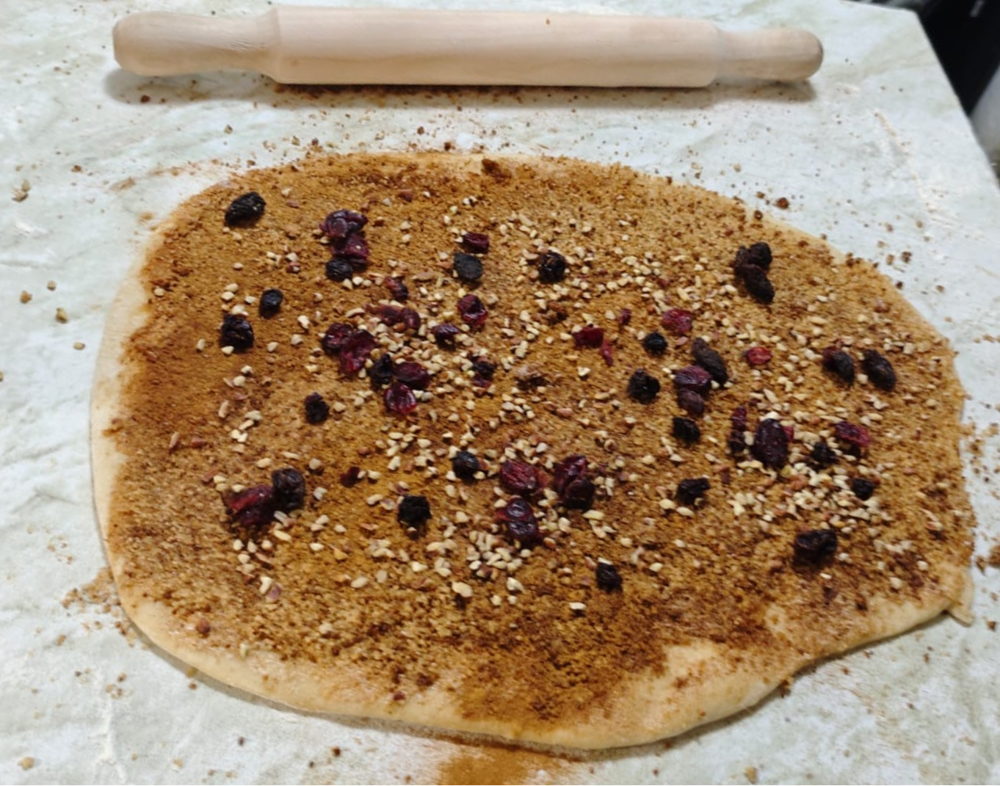
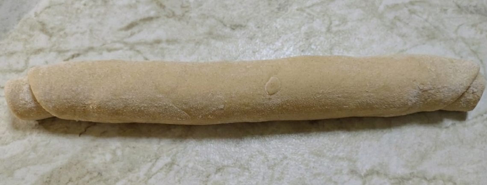
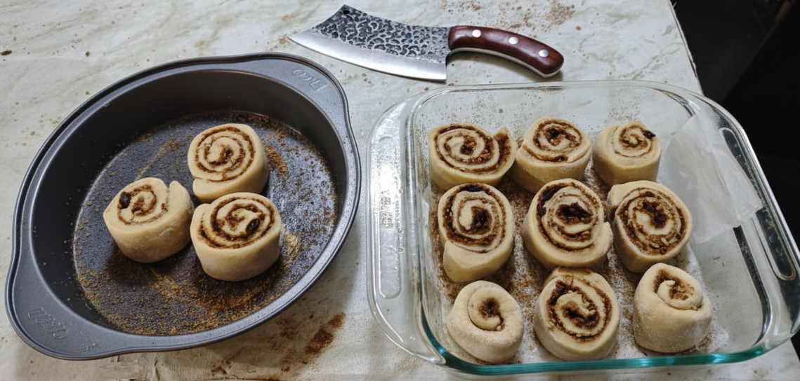
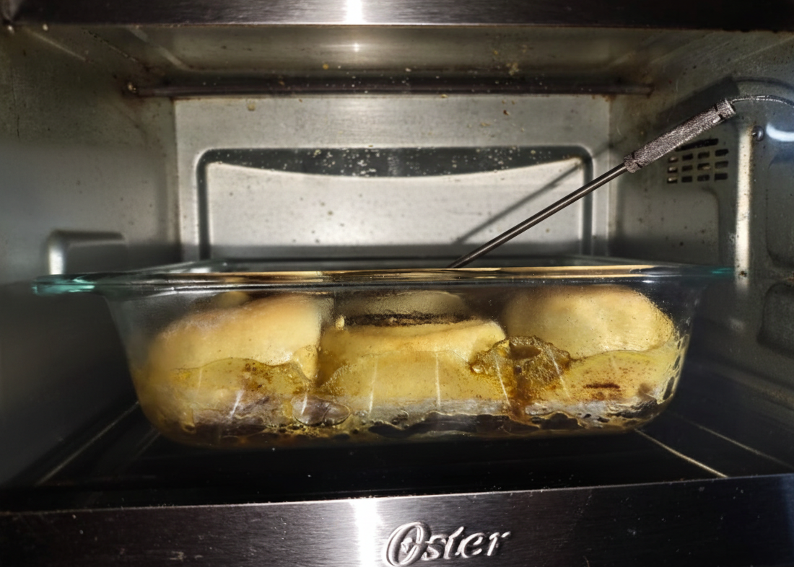
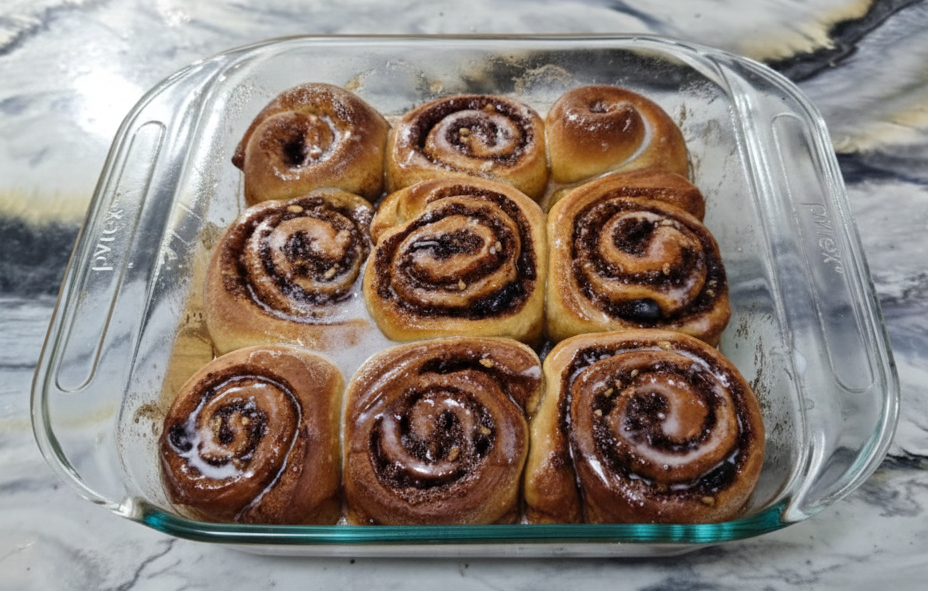

# Roles de canela en máquina de pan y horno

>Esta receta aprovecha la máquina de pan para el amasado y el primer levado. Una vez que la masa ha hecho su trabajo, el resto del proceso se completa a mano y en el horno convencional para lograr unos roles suaves y bien glaseados.

## Ingredientes

### Para la masa (cubeta)
- 180 g de leche tibia
- 1 huevo (~50 g sin cáscara)
- 50 g de azúcar
- 22 g de aceite de canola (o 30 g de mantequilla, si prefieres)
- 5 g de sal
- 420 g de harina de trigo
- 7 g de levadura seca

### Relleno
- 40 g de mantequilla suave
- 100‑120 g de azúcar (muscabado o blanca)
- 12‑15 g de canela molida
- Opcional: pasas, arándanos, nuez (40‑80 g,)

### Glaseado de canela (líquido a gusto)
- 120 g de azúcar glass
- 20‑40 g de leche (añadir poco a poco hasta lograr consistencia de “hilo”)
- Opcional: 2 g de extracto de vainilla y/o canela

## Preparación paso a paso

### 1. Amasado y primer levado con la máquina

1. Añade a la cubeta, en este orden, la leche tibia, el huevo, el azúcar, la sal y el aceite.
2. Cubre con la harina y haz una pequeña depresión para verter la levadura sin que toque los líquidos.
3. Selecciona el programa **Dough/Masa** y deja que la máquina trabaje.

**A los 5‑10 min** revisa la masa: debe formarse una bola suave. Ajusta con pequeñas cantidades de harina o leche si está demasiado húmeda o seca.
La prueba del dedo (hazas un hoyo y debe regresar lentamente) es más importante que el volumen dentro de la cubeta: indica fermentación correcta.

> Mientras la máquina amasa y leva, aprovecha el tiempo para preparar el relleno, el glaseado y los moldes.

### 2. Preparar el relleno y los extras
- Mezcla el azúcar y la canela en un bowl.
- Deja la mantequilla a temperatura ambiente hasta que esté pomada.
- Engrasa y/o forra el molde principal (20×20 cm) con papel de horno. Opcional: espolvorea una mezcla de azúcar y canela en el fondo para crear una costra caramelizada.
- Prepara el glaseado ajustando la leche para que al caer en hilos finos se vea líquido.

### 3. Formar y cortar los roles

1. Coloca la masa sobre una superficie ligeramente enharinada y estira hasta un rectángulo de unos 35×45 cm.

2. Unta la mantequilla y espolvorea la mezcla de azúcar y canela.
3. Distribuye los extras (pasas, arándanos, nuez) de manera uniforme.

4. Enrolla apretado a lo largo para evitar huecos y corta en 12 porciones de 2.5‑3 cm con hilo dental o un cuchillo muy afilado.

### 4. Segundo levado en molde

- Coloca los roles en el molde preparado; caben 9 cómodos o 12 apretados (tipo pull‑apart). Puedes usar dos moldes si prefieres hornear menos cantidad en cada uno.
- Deja levar 60‑120 min, vigilando más el aspecto que el reloj: deben verse hinchados y rozarse ligeramente. La prueba del dedo sigue siendo útil.
- Si tienes prisa, calienta el horno un minuto, apágalo y mete el molde tapado con una taza de agua caliente para crear un microclima tibio.

### 5. Hornear y comprobar el punto

- Precalienta el horno a 180 °C y coloca la rejilla en el centro.
- Usa un termómetro insertado en el centro de un rol que no toque el molde.
- Si el tope se dora demasiado pronto (12‑15 min), cúbrelo flojamente con papel aluminio.
- Hornea 15‑22 min para moldes poco llenos, 22‑32 min para los muy llenos.
- Busca 88‑93 °C en el interior.
> En la tanda documentada se alcanzaron 94 °C y quedaron bien cocidos pero si los quieres mas claros 90 °C.

### 6. Glaseado y reposo

- Saca los roles calientes y vierte el glaseado líquido en “hilos” para humectar.
- Si deseas, espera 10‑15 min antes de cortar para mejorar la miga.
> **Opcional:**
> - Añade una segunda capa de glaseado más espeso luego.
> - En caso de que queden algo secos, 10‑15 s en el microondas con una servilleta húmeda ayuda a recuperar jugosidad.

## Consejos adicionales
- Un volumen discreto en la cubeta no es preocupante; la masa suele «explotar» más durante el segundo levado y horneado.
- Para mas suavidad saca los roles a 90‑92 °C , a 93-94 °C para un dorado mejor en la corteza.
- Usa aluminio a los 12‑15 min si el molde está muy lleno y ajusta el tiempo según el termómetro.
- Si reemplazas mantequilla por aceite, calcula ~75 % del peso: 30 g de mantequilla ≈ 22 g de aceite de canola.

## Valor nutricional aproximado
| Métrica | **Lote completo (12 roles)** | **1 rol (1/12)** |
|---|---:|---:|
| **kcal** | **3512** | **293** |
| **Proteína (g)** | **60.5** | **5.0** |
| **Grasa (g)** | **71.2** | **5.9** |
| **Carbos totales (g)** | **665.8** | **55.5** |
| **Fibra (g)** | **22.9** | **1.9** |
| **Carbos netos (g)** | **642.9** | **53.6** |
| **Azúcares (g)** | **325.2** | **27.1** |

# **¡Disfruta tus roles!**

